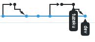

## Gitflow
### Gitflow là gì
Gitflow là 1 quy trình làm việc với Git

### Các branch dùng trong gitflow
- Gồm 5 nhánh sau: ```master, develop, feature, release, hotfix```
- 2 nhánh ```develop``` và ```master``` (và chỉ 2 nhánh này) tồn tại mãi mãi, nên có thể gọi chúng là ```main branch```. Các nhánh còn lại: ```feature```, ```release```, ```hotfix``` gọi là ```support branch```, sẽ có vòng đời ngắn hơn và cuối cùng sẽ bị xóa bỏ sau khi hoàn thành nhiệm vụ
- Nhánh ```master``` là nhánh mà source code của HEAD lưu trữ trạng thái mới nhất của production
- Nhánh ```develop``` là nhánh mà source code của HEAD lưu trữ các thay đổi, tính năng (feature) mới nhất cho lần phát hành tiếp theo
- Nhánh ```feature```:
  + Rẽ nhánh (branch off) từ: ```develop```
  + Sẽ được merge vào: ```develop```
  + Convention: ```feature-*```
  + Dùng để phát triển tính năng mới cho lần release tiếp theo
  + Các nhánh ```feature``` **KHÔNG** bao giờ **tương tác trực tiếp** với nhánh **master**
  + Sau khi tạo nhánh ```release``` từ nhánh ```develop``` thì **KHÔNG** có thêm nhánh ```feature``` nào được tạo thêm nữa (tức là sau giai đoạn này, sản phẩm ko còn tính năng mới hay issue, bug mới nào nữa)
- Nhánh ```release```:
  + Rẽ nhánh từ: ```develop```
  + Sẽ được merge vào: ```develop``` và ```master``` (cùng 1 lúc)
  + Convention: ```release-*```
  + Dùng để release 1 phiên bản mới trên production
- Nhánh ```hotfix```:
  + Rẽ nhánh từ: ```master```
  + Sẽ được merge vào: ```develop``` và ```master``` (cùng 1 lúc)
  + Convention: ```hotfix-*```
  + Dùng để fix critical bug (bug mà cần fix ngay lập tức) trên production
- Nhánh ```release``` và ```hotfix``` có 1 điểm chung là đều merge vào 2 nhánh ```develop``` và ```master```

### Quy trình của gitflow
- Khởi tạo dự án: tạo nhánh ```develop``` từ ```master```
- Có task (feature mới, bug mới), team member pull latest code từ ```develop``` về, sau đó tạo 1 nhánh feature từ ```develop```. Giả sử team dùng Jira quản lý dự án, và tên jira ticket là IAGENT-123 chẳng hạn (IAGENT là tên project), thì có thể tạo 1 nhánh tên là ```feature-123``` hoặc ```IAGENT-123``` ở *local*: ```git checkout -b feature-123```
- Member làm xong task thì sẽ push lên để tạo Pull request (PR). Nhưng trước khi push cần lấy latest code của nhánh develop về trước đã (vì nhánh develop lúc này có thể có thêm các commit của các member khác đã push trước đó). Có 3 cách để lấy latest code từ develop:
  + Cách 1: merge branch develop vào nhánh hiện tại: ```git pull origin develop```. Cách này sẽ tạo ra 1 commit có tên là "Merge branch 'develop' into feature-123"
  + Cách 2: do việc merge như cách 1 sẽ tạo thêm 1 commit merge gây thừa, nên có cách khác là rebase từ nhánh develop. Đầu tiên checkout sang develop, sau đó pull code develop về: ```git pull```. Sau đó checkout lại sang branch feature-123, rồi rebase. Trước khi rebase, cần stash trước: ```git stash```. Sau đó rebase: ```git rebase develop```. Rồi lấy bản code từ stash ra: ```git stash pop```. Lúc này nếu có conflict thì sửa, sau đó push code lên
  + Cách 3: giống cách 1, nhưng bỏ commit merge đi bằng cách reset HEAD về commit trước commit merge (có thể dùng cli hoặc gitk để reset), rồi push -f nhánh feature-123 lên remote :v
- Tạo Pull request (PR) từ ```feature-123``` -> ```dev```
- Chờ teamlead và các member khác review PR, nếu lỗi thì sửa rồi push -f lại (để đảm bảo mỗi PR chỉ có 1 commit). Xong xuôi merge PR vào dev
- Sau khi làm xong hết các feature, build 1 bản lên môi trường staging và request team QA test sản phẩm
- Trong quá trình test nếu phát hiện lỗi, đội dev lại tạo nhánh mới từ develop và fix các issue này như quá trình phát triển các feature mới
- Test xong xuôi hết, tạo 1 nhánh release từ develop, giả sử tên là ```release-20210208``` (ứng với ngày release). Tất nhiên mọi thứ phải làm xong trước ngày release. Từ lúc này tới ngày release, nếu trên staging có bug thì sẽ fix bug trên nhánh release đó
- Tới ngày release: deploy nhánh ```release-20210208``` lên môi trường production
- Merge lại nhánh ```release-20210208``` vào ```develop``` và ```master```. Gắn tag cho nhánh ```master```, sau đó có thể xóa bỏ nhánh ```release-20210208```
- Nếu phát hiện lỗi trên production: tạo 1 nhánh hotfix để fix sớm, sau đó tạo PR và merge nhánh đó vào ```develop``` và ```master```

### Ref
- https://danielkummer.github.io/git-flow-cheatsheet/index.vi_VN.html
- https://www.atlassian.com/git/tutorials/comparing-workflows/gitflow-workflow
- https://nvie.com/posts/a-successful-git-branching-model/

## Git reset
Đầu tiên cần biết git có 3 khu vực (area) như hình vẽ, gọi tắt là working area, staging area, repository area


- Working area: lưu trữ những thay đổi trên các file
- Staging area: lưu trữ các file được thay đổi để chuẩn bị cho commit
- Repository area: lưu trữ các file đã được commit ở staging area. Repository là nơi sẽ ghi lại trạng thái, lịch sử thay đổi của thư mục và file. Khu vực này nằm ở thư mục .git. Có 2 loại là local repository (ở máy mình) và remote repository (ở trên server remote).

Giả sử trong working area hiện tại, ta sửa file abc.txt và sau đó add nó vào staging area: ```git add abc.txt```

```git reset --hard commit_sha1```:
- Reset HEAD về commit commit_sha1
- Xóa bỏ mọi thay đổi trên working directory (khu vực này đang có file abc.txt được thay đổi, và các file đã thay đổi ở commit_sha1)
- Xóa bỏ mọi thứ trên staging area
- Nếu ko chỉ rõ commit_sha1 thì HEAD vẫn giữ nguyên

```git reset --mixed commit_sha1``` (đây là chế độ mặc định, nếu ko thêm option cho lệnh reset thì git sẽ hiểu đó là --mixed):
- Reset HEAD về commit commit_sha1
- Giữ lại mọi thay đổi working directory (lúc này khu vực này sẽ gồm file abc.txt được thay đổi, và các file đã thay đổi ở commit_sha1)
- Xóa bỏ mọi thứ trên staging area, tức là lúc này staging area ko có file nào
- Nếu ko chỉ rõ commit_sha1 thì HEAD vẫn giữ nguyên

```git reset --soft commit_sha1```:
- Reset HEAD về commit commit_sha1
- Giữ lại mọi thay đổi working directory
- Giữ lại mọi thứ trên staging area (lúc này khu vực này gồm file abc.txt và các file ở commit_sha1)
- Nếu ko chỉ rõ commit_sha1 thì lệnh này chả có tách dụng gì!

Ref:
- https://www.javatpoint.com/git-index
- https://www.javatpoint.com/git-reset

## Git rebase
### Git merge vs git rebase
- Giả sử nhánh develop đang có 2 commit d1, d2, tạo 1 nhánh mới là feature từ develop lúc này để làm việc. Trong quá trình làm việc trên feature, nhánh feature xuất hiện 2 commit f1, f2, đồng thời nhánh develop xuất hiện thêm vài commit mới d3, d4, lúc này cần lấy những commit đó từ develop sang feature. Có thể dùng merge hoặc rebase từ develop sang feature
- Merge:
  + Tạo ra 1 commit merge từ develop sang feature.
  + Là 1 lệnh ko mang tính phá hủy (nondestructive): những nhánh đang tồn tại không bị thay đổi
  + Merge sẽ tạo ra lịch sử commit có dạng hình thoi. Nếu nhánh develop thay đổi liên tục, mà mỗi lần đó ta đều muốn lấy code từ develop về, thì sẽ tạo nhiều commit merge từ develop vào feature => commit thừa, và rất nhiều hình thoi chằng chéo :))
- Rebase :
  + Đưa toàn bộ những commit mới f1, f2 ở nhánh feature nối tiếp vào "ngọn" của nhánh develop, lúc này develop sẽ gồm các commit d1, d2, d3, d4, f1, f2. Thực chất việc rebase này sẽ **viết lại lịch sử** (rewrite history) của project bằng cách **tạo ra những commit mới ứng với mỗi commit của nhánh feature** (rồi lần lượt **append những commit đó vào ngọn của develop**) (giờ muốn push phải dùng **push -f**). Sau đó chuyển HEAD của feature về commit mới nhất là f2
  + Rebase sẽ tạo ra lịch sử commit có dạng tuyến tính nên commit sẽ rõ ràng, dễ theo dõi hơn. Nếu nhánh develop thay đổi liên tục, thì việc này sẽ ko tốn thêm nhiều commit merge thừa, đồng thời lịch sử commit sẽ thẳng tắp
- Có thể dùng như sau:
  + Rebase từ develop vào feature để get latest code trong khi đang làm task trên nhánh feature
  + Merge từ feature vào develop sau khi xong task
  + Nếu làm theo thứ tự trên thì có thể fast-forward merge
- VD:
  + Giả sử có 2 nhánh tuzaku và dev. Hiện tại nhánh tuzaku đang có 2 commit mới hơn so với dev
  
  
  
  + Sau khi merge ```--no-ff``` (tạo PR từ tuzaku -> dev, sau đó merge PR với option đầu tiên là "Create a merge commit"), graph sẽ trông như này
  
  
  
  + Bây giờ ở local, đứng ở nhánh tuzaku gõ lệnh ```git pull origin dev```, thì git sẽ merge ```fast-forward``` từ dev ngược lại tuzaku, việc merge fast-forward lúc này giống như rebase từ dev vậy, graph sẽ thành như sau
  
  
  
  + Tuy có hình thoi chứ graph ko thằng tuột, những sẽ biết được lịch sử là đã từng merge từ nhánh nào đó vào nhánh dev. Nếu tất cả dùng rebase, thì 2 hình thoi đó sẽ chỉ là 1 đường thẳng

- Ref: https://viblo.asia/p/git-merging-vs-rebasing-3P0lPvoGKox

## Github pull request (PR)
### Merge PR
Có 3 cách để merge 1 PR chọn từ dropdown trên trang github, giả sử tạo 1 PR từ nhánh feature-123 vào dev
- Create a merge commit: như tên gọi, cách này sẽ tạo 1 commit merge với option ```--no-ff```
- Squash and merge: gộp tất cả các commit ở nhánh feature-123 lại thành 1, sau đó merge ``` fast-forward``` nhánh này vào nhánh dev
- Rebase and merge: tất cả các commit ở nhánh feature-123 sẽ được thêm vào nhánh dev mà KHÔNG tạo thêm commit merge

## Git cherry-pick
Dùng để pick (mang, bưng) 1 commit bất kỳ từ nhánh khác sang HEAD của nhánh hiện tại

### Khi nào cần dùng git cherry-pick
- Undo changes, restore commit cũ: giả sử có 1 commit ở nhánh feature-123. Feature này đã hoàn thiện nhưng sau đó leader bảo ko cần thiết áp dụng feature này vào đợt release lần này. Thế là ko tạo PR và nhánh feature-123 bị lãng quên. Sau này nếu cần bổ sung feature đó ta chỉ việc cherry-pick commit đó từ nhánh feature-123
- Commit sai branch: có thể checkout sang nhánh khác bê commit vừa làm xong sang nhánh đó
- Updating...

## Git reflog
Dùng để restore lost commit:
- Giả sử vừa rebase từ master vào dev nhé, giờ muốn undo việc đó. Đầu tiên cần tìm head commit của dev ngay trước khi rebase bắt đầu bằng lệnh ```git reflog```. Nhớ là phải tìm đúng nhé! Giả sử tìm được HEAD đó là ```HEAD@{5}```
- Giờ reset dev về commit đó là được: ```git reset --hard HEAD@{5}```

## Git fsck (File System ChecK)
Cũng dùng để restore

*Recover staged changes*: những file vừa được thêm vào staging area (bằng lệnh ```git add```), sau đó ```reset --hard```, thì recover như nào?
- Đầu tiên run command: ```git fsck --lost-found```
- Vào thư mục .git/lost-found/other sẽ tìm thấy file muốn recover

*Recover uncommitted changes*: các file ở working directory chưa được add vào staging area: KHÔNG thể recover được. Giả sử mới thêm 1 file mới, edit rồi lỡ tay xóa nó mà chưa add vào staging, thì có thể dùng IDE để recover (Eclipse, VS Code, Intellij đều hỗ trợ việc này) (git bó tay ko recover được nhé (???))
